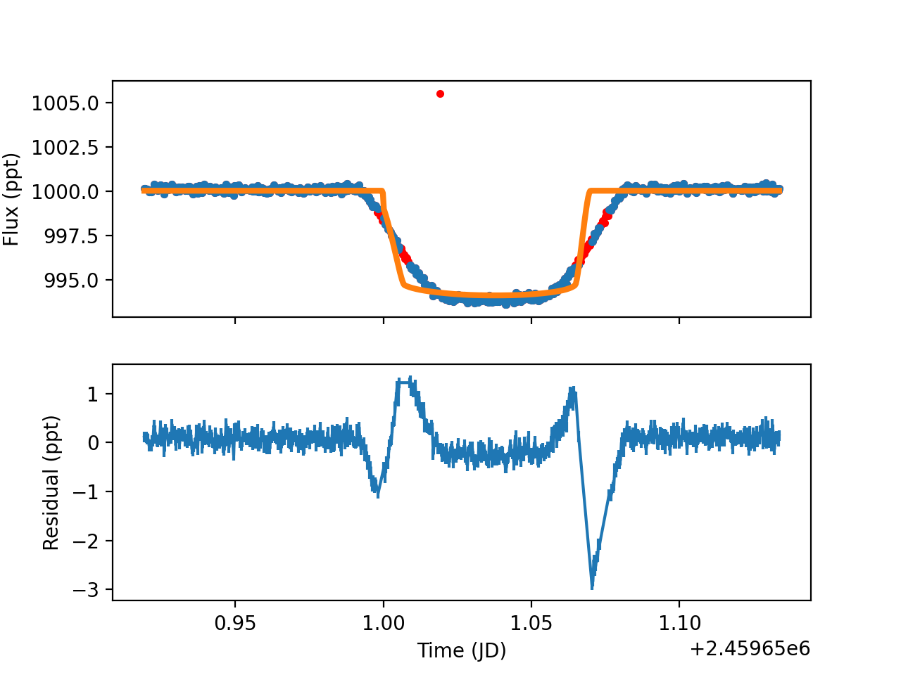

Why isn't my code working?
==========================

If you're here, something has probably gone wrong. In this section, I'm going to provide examples of what an error in each of the inputs can result in.

FileNotFoundError
~~~~~~~~~~~~~~~~~

This is likely the first error you will encounter, if you encounter any. In the example code, I process this error statement in order to download the correct files from Zenodo to the correct locations on your computer so that no action is required on your part. You're welcome to do this as well, but it's much easier to just put the files in the correct locations with the correct names

Errors in Inputs
~~~~~~~~~~~~~~~~~

Here are all the parameters where an incorrect input can have an impact on the lightcurve fit, and what each of them looks like.

t0_lit
~~~~~~~~~~~~~~~~~

If your input for t$_0$_lit is incorrect, you will likely get an output lightcurve fit that looks like this:

To fix this, simply set your t$_0$_lit to the time value at the center of the transit data.

period_lit
~~~~~~~~~~~~~~~~~

If your input for period_lit is too high, you will likely get an output that looks like this, though probably not as exaggerated:

To fix this, try using a different period from https://exoplanetarchive.ipac.caltech.edu/, or just decrease your period until the plot fits.

If your input for period_lit is too low, you will likely get an output that looks like this:

To fix this, try using a different period from https://exoplanetarchive.ipac.caltech.edu/, or just increase your period until the plot fits.

inc_lit
~~~~~~~~~~~~~~~~~

If your input for inc_lit is too high or too low, you will likely get an output that looks like this:

To fix this, try using a different inclination from https://exoplanetarchive.ipac.caltech.edu/, or just alter your inclination until the plot fits. Increasing your uncertainty will help PyMC3 find the correct inclination.

a_lit
~~~~~~~~~~~~~~~~~

If your input for a_lit is too high, you will likely get an output that looks like this, though probably not as exaggerated:

To fix this, try using a different a/$R_*$ from https://exoplanetarchive.ipac.caltech.edu/, or just decrease your period until the plot fits.

If your input for a_lit is too low, you will likely get an output that looks like this, though probably not as exaggerated:

To fix this, try using a different a/$R_*$ from https://exoplanetarchive.ipac.caltech.edu/, or just increase your period until the plot fits.

u_lit
~~~~~~~~~~~~~~~~~

If your input for u_lit is incorrect, there are a lot of funky things can happen. Here are two examples:

As you can see, one of these is much more extreme than the other, but there is room for a lot of variability with issues in this variable. Personally, I found using the quadratic version to simplify things a lot, but may create a small artifact in the ingress and egress of the transit. The quadratic can be calculated here https://exoctk.stsci.edu/limb_darkening (see instructions in *Fitting Lightcurves*), and you must change *ld_law* to 'quadratic'.

ecc
~~~~~~~~~~~~~~~~~

Depending on your *omega*, if your input for ecc is too high, you will likely get an output that looks like this:

To fix this, try using a different eccentricity from https://exoplanetarchive.ipac.caltech.edu/, or just decrease your eccentricity until the plot fits.