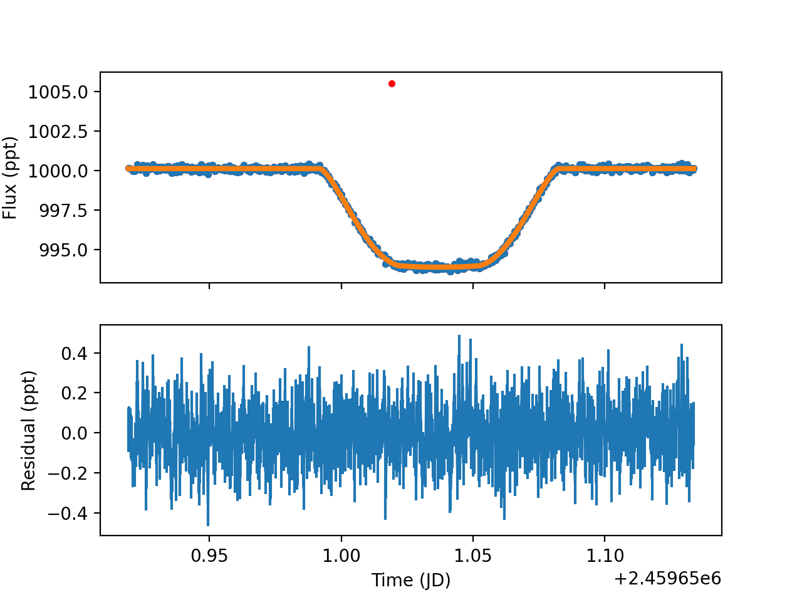

Creating your first fit
=========================

The first thing you want to do when using ABATE is to create a compatible virtual environment and install the ABATE package to it. To do this, you'll need to run the following three commands in your command line:

.. code-block:: python

   import abate
   from abate import fit_GENERIC
   fit_GENERIC.do_fitting()

NOTE: If you've cloned the GitHub (See *Installation*) or downloaded the python scripts from there, you can do the operation performed by the above code in your preferred way.

Running this may take a while, especially if you have not run anything with PyMC3 before. When it's done, it will have created several folders and files within your working directory. One of those directories should be 'plots/lc_plots/mirage_038_hatp14_p001_A3_phot_no_backgsrc_starry_003_fix_LD', which should contain within it an image that looks like this:

If it doesn't, then something's gone wrong! (Hopefully not though)

Fitting Your Own Lightcurve
---------------------------

What do I do with that .yaml file?
~~~~~~~~~~~~~~~~~~~~~~~~~~~~~~~~~~~

Using fit_GENERIC.py as a template, we can get to fitting your own lightcurve data! To get this file, make sure you clone the GitHub with the command found in *Installation*.

First, take a look at that .yaml file that was downloaded to  '/parameters/phot_params/jwst_test_data/sim_mirage_038_hatp14_no_backg_source'. This file contains lots of basic but useful information about the observation, and you can either edit this one to match your data, or create your own.

Looking at fit_GENERIC, we can see that this sequence of folders directly corresponds to the variable "paramPath" at the beginning of the function. Modify this so it matches the location of your own .yaml file.

Inputs into simple_pymc_fits.exo_model
---------------------------------------

descrip
~~~~~~~~

This is just a string, and will be what all the final output files and folders will be named as. Change this to your liking (I personally match this to the name of the .yaml file, though it isn't matched in the example).

t$_0$_lit
~~~~~~~~~

This variable is a tuple, with the first value being time, and the other being the uncertainty on the time. You can find this information on the Caltech exoplanet archive, https://exoplanetarchive.ipac.caltech.edu/, along with information for many other values we will be using. If the time is incorrect, it will not fit your data - see *Error Fixes* for more information on how to resolve this issue. Note that a small error in t$_0$_lit can have a large impact on the fit of your lightcurve.

period_lit
~~~~~~~~~~

This variable is a tuple, with the first value being the orbital period in days, and the second value is the uncertainty on the period. This value can be found on the Caltech exoplanet archive, https://exoplanetarchive.ipac.caltech.edu/.

inc_lit
~~~~~~~

This variable is a tuple, with the first value being inclination of the orbit (with 90º being edge on), and the second value being the uncertainty on the inclination. This value can be found on the Caltech exoplanet archive, https://exoplanetarchive.ipac.caltech.edu/, but note that a slight error in inclination can have a noticeable negative outcome on the fit of your lightcurve - see *Error Fixes* for more information on how to resolve this issue.

a_lit
~~~~~~

This variable is a tuple, where the first value is the semimajor axis divided by $R_*$, and the second value is the uncertainty. This information can be found on the Caltech exoplanet archive, https://exoplanetarchive.ipac.caltech.edu/, where it is formatted to the correct unit for this package.

u_lit
~~~~~~~
If u_lit is a list:
   If this variable is a list, and is the limb darkening parameter. It has two main modes:

   1. quadratic, where the list is two values long
   2. multiterm, where the list has the same number of values as the value of the variable starry_ld_degree

   When either of these modes are used, limb darkening becomes a fixed parameter, and is not sampled by PyMC3. However, if *u_lit* is set to *None*, then it becomes a free parameter that is sampled by PyMC3, though it will take longer to run.

To calculate the values needed for the two main modes, you can visit https://exoctk.stsci.edu/limb_darkening, which allows you to select your target and the filter used to collect the data, choose your type(s) of limb darkening law, and calculate the coefficients needed. For quadratic, you will use the values under *c1* and *c2* in the table, and for multiterm, you will should follow the instructions in the notebook tutorial.

If u_lit is None: it is fit with priors
If u_lit is `interpSpecOnly`, the broadband limb darkenign parameters are fit, but the spectroscopic ones are fixed to a model (interpolated to the relevant wavelength)

u_lit_file
~~~~~~~~~~
Either a string with the path name or None.
This is only used if `u_lit` is `interpSpecOnly` to set up interpolation functions. Look up the `.ecsv` file for limb darkening interpolation.
The `.ecsv` file should have metadata with the "law" (e.g. 'quadratic') and the "degree" (e.g. 2 for quadratic)
The file should have 1 column called "wave" and one for each limb darkening parameter e.e.g "u1" and "u2".

starry_ld_degree
~~~~~~~~~~~~~~~~~

This variable is an integer, and is the polynomial degree starry will use to fit the star and planet to. The higher this number, the more accurate the results, but the longer the function will take to run. It is set to 6 by default.

ecc
~~~~

This variable is a tuple, with the first value being the eccentricity of the orbit, and the second value being the uncertainty. This value can be found on the Caltech exoplanet archive, https://exoplanetarchive.ipac.caltech.edu/.

omega
~~~~~~~

This variable is a tuple, with the first value being ____________, and the second value is the uncertainty. This value can be found on the Caltech exoplanet archive, https://exoplanetarchive.ipac.caltech.edu/.

recalculateTshirt
~~~~~~~~~~~~~~~~~~~~~

This variable is a Boolean, either True or False, that determines whether or not Tshirt recalculates values if pipeType = 'spec'. It is set to True by default.

pipeType
~~~~~~~~~

This variable is a string, set to either 'phot' for photometry or 'spec' for spectroscopy.
Or, you can set the input X/Y manually to :code:`customPhot` for custom photometry and 
specify the data in :code:`customData`
If there is a batch file of spectroscopy that works on many observations or configurations, set pipeType to 'batchSpec' and choose which number/index of the batch to select with 'batchInd'

ld_law
~~~~~~~

This variable is a string, set to either 'quadratic' or 'multiterm', which determines the length of the list for u_lit.

fitSigma
~~~~~~~~
Re-fit the error bar in the optimization/posteriors?
If fitSigma is "fit", it will be fit to 1 value for all fluxes.
If "oot" it will use the out-of-transit value. If None, it will use the value from yerr.

fixLDu1
~~~~~~~
For spectroscopic fits, fix the Limb Darkening coefficient u1 at the posterior value from the broadband.

ld_start
~~~~~~~~
Optionally change theh limb darkening starting guess

trendType
~~~~~~~~~
What of kind of trend should be fit to the data? Options are

* :code:`None` Assumes the baseline is flat
* :code:`poly` Assumes a polynomial centered at the median time and has the order
* :code:`fpah` Assumes a linear function of the focal plane housing (FPAH) temperature deviation
* :code:`refpix` Assumes a linear function of the mean reference pixels
* :code:`poly+fpah` Assumes a polynomial and a linear function with focal plane array housing (FPAH) temp 
* :code:`gp` Include a Gaussian process

poly_ord
~~~~~~~~~
What order polynomial should be fit to the baseline? Only matters if the :code:`trendType` is set to :code:`'poly'`.
If poly_ord = 1, it is a linear fit, poly_ord=2 is a quadratic baseline.

legacy_polynomial
~~~~~~~~~~~~~~~~~
Earlier version of ABATE used a polynomial model of the form :code:`f= f_0 + A x + B x**2 + C x**3`, etc, which is an additive polynomial.
If :code:`legacy_polynomial` is True, it uses a polynomial like :code:`f= f_0 + A x + B x**2 + C x**3`.
Later versions use a polynomial of the form :code:`f = f_0 * (1. + A x + B x**2 + C x**3)`, etc. which is a multiplicative polynomial. 
If :code:`legacy_polynomial` is False, it uses a polynomial like :code:`f = f_0 * (1. + A x + B x**2 + C x**3)`.

eclipseGeometry
~~~~~~~~~~~~~~~
What is the geometry of the eclipse. Possibilities include "Transit", "Eclipse" or "PhaseCurve". If it's set as "Eclipse", the eclipse amplitude will be fit assuming no limb darkening. If it's "Transit", the limb darkening will either be fit or fixed depending on :code:`u_lit` and the transit radius will be fit.

fitSinusoid
~~~~~~~~~~~
Fit a sinusoid to the phase curve variations?

phaseCurveFormulation
~~~~~~~~~~~~~~~~~~~~~

If it is 'old-legacy', it was a quick wrong way Fp(phi) - (1.0 - A cos(phi + phi_0))
'standard', it will be Fp(phi) = (1.0 - A - A cos(phi + phi_0))

differentialMode
~~~~~~~~~~~~~~~~~
If False, fit the absolute transit depths/eclipse depths. If True, divide by the broadband.

expStart
~~~~~~~~
Should the beginning be fit with an exponential? If True, there will be one exponential.
If set to "double", two exponentials will be used.

expPriorTau
~~~~~~~~~~~
Prior on the lightcurve exponential timescale geometric mean (which is also the median)

expPriorTauSigma
~~~~~~~~~~~~~~~~
Prior on the log of the geometric mean of the log-normal distribution (ie. "sigma")

mask
~~~~
A mask of points to include in the fitting. Useful if skipping some obviously bad points. If set to :code:`None`, no points are rejected initially, but may be rejected later depending on the :code:`sigReject` parameter.

offsetMask
~~~~~~~~~~
A numpy array of integrs to allow for offsets at specific integrations (such as between exposures or before/after a tilt)

timeBin
~~~~~~~
An integer that says how many bins should be linearly spaced in time. This is just to speed up model evaluation time.

override_times
~~~~~~~~~~~~~~
A numpy array that will override the time arrays. Useful if checking barycentric corrections.

wbin_starts
~~~~~~~~~~~
You can manually specify the start pixels in the dispersion direction for wavelength bins, which is passed to `make_wavebin_series <https://tshirt.readthedocs.io/en/latest/modules.html#tshirt.pipeline.spec_pipeline.spec.make_wavebin_series>`_

wbin_ends
~~~~~~~~~
You can manually specify the end pixels in the dispersion direction for wavelength bins, which is passed to `make_wavebin_series <https://tshirt.readthedocs.io/en/latest/modules.html#tshirt.pipeline.spec_pipeline.spec.make_wavebin_series>`_

correctedBinCenters
~~~~~~~~~~~~~~~~~~~~
By default, ABATE assumes that the center of each wavelength bin is the middle of the pixels 
defining that bin. However, for highly non-linear dispersiosn (such as a prism), the wavelength 
center is not the same as the pixel center.
If correctedBinCenters is True, the central wavelength is returned for the spectrum.
If correctedBinCenters is False, the detector pixel center evaluated with the wavelength solution
is returned as the wavelength center.
It should be used as True in future cases, but with compatibility with previous runs, 
correctedBinCenters can be set to False.

customData
~~~~~~~~~~
By default, ABATE assumes that the input data comes from a :code:`tshirt` parameter file.
It may be preferable to put in custom data by setting :code:`pipeType='customPhot'`
In this case, :code:`customData` should be in the format of a dictionary, with the following keys
:code:`x` : the time coordinate in BJD
:code:`y` : the flux, which will be automatically re-normalized
:code:`yerr` : the error in flux,  which will be automatically re-normalized
:code:`srcname` : 
If :code:`customData` is :code:`None`, it will be ignored.

batchInd
~~~~~~~~~~~~
If pipeType is 'batchSpec', then use this index to set which of many different reductions/observations is used.

rho_gp_sigma
~~~~~~~~~~~~
Geometric standard deviation of the rho (timescale) parameter of the Gaussian process

TShirt
------

For more information on *recalculateTshirt* and *pipeType*, visit tshirt's documentation at https://tshirt.readthedocs.io/en/latest/index.html. Tshirt is automatically downloaded as part of the ABATE package, so there is no need to follow the install procedure.

